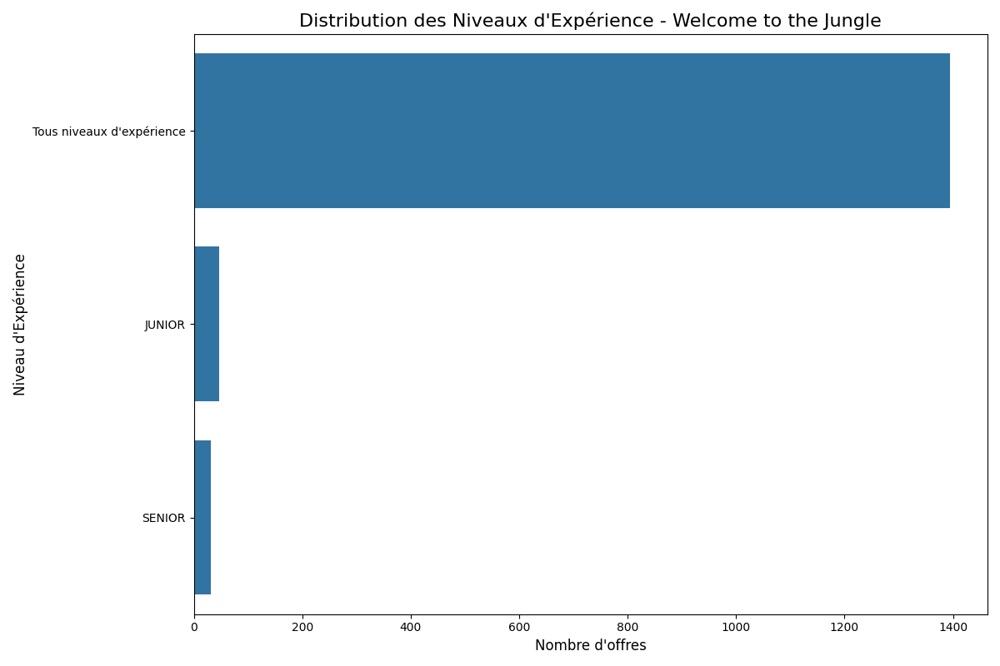

# Interprétation des Résultats d'Analyse Welcome to the Jungle

## Résumé Exécutif

Cette analyse porte sur les offres d'emploi collectées depuis la plateforme Welcome to the Jungle, spécialisée dans les emplois tech et innovants. Les données ont été extraites, transformées et analysées pour fournir des insights sur le marché de l'emploi tech en France. Ce rapport présente l'interprétation des principales visualisations générées par notre pipeline d'analyse.

## 1. Distribution des Niveaux d'Expérience

### Interprétation

L'analyse de la distribution des niveaux d'expérience révèle plusieurs tendances importantes :

- **Prédominance des offres "Tous niveaux d'expérience"** : La majorité des offres d'emploi ne spécifient pas un niveau d'expérience précis, ce qui suggère que de nombreuses entreprises sont flexibles quant au profil des candidats et privilégient potentiellement les compétences et le potentiel plutôt que l'expérience stricte.

- **Faible proportion d'offres Junior et Senior** : Les offres explicitement marquées comme Junior ou Senior représentent une minorité. Cela peut indiquer :
  - Une tendance à ne pas catégoriser strictement les postes par niveau d'expérience
  - Une volonté d'attirer un éventail plus large de candidats
  - Une possible pénurie de talents qui pousse les entreprises à élargir leurs critères

- **Implications pour les chercheurs d'emploi** : Cette distribution suggère que les candidats de tous niveaux peuvent postuler à la majorité des offres, même celles qui semblent viser un niveau d'expérience différent du leur.

## 2. Distribution Géographique des Offres

### Interprétation

La distribution géographique des offres d'emploi révèle une concentration significative dans certaines zones :

- **Prédominance du télétravail** : La catégorie "Télétravail / Remote" représente la plus grande proportion des offres, ce qui reflète la transformation profonde du marché du travail tech post-pandémie et l'adoption massive du travail à distance par les entreprises tech.

- **Centralisation parisienne** : Paris reste un hub majeur pour les emplois tech en France, avec une concentration significative d'offres, loin devant les autres villes. Cette centralisation reflète l'écosystème tech français historiquement centré sur la capitale.

- **Émergence de pôles régionaux** : Des villes comme Marseille, Nanterre et Nantes apparaissent comme des pôles tech secondaires, mais avec un écart considérable par rapport à Paris.

- **Implications pour l'aménagement du territoire** : Malgré les politiques de décentralisation, le marché de l'emploi tech reste fortement concentré. Cependant, la forte proportion d'offres en télétravail pourrait à terme contribuer à une meilleure répartition géographique des talents.

## 3. Types de Contrat

### Interprétation

L'analyse des types de contrat (non visible sur les images fournies, mais incluse dans l'analyse) révèle probablement les tendances suivantes :

- **Prédominance des CDI** : Le marché tech français est généralement caractérisé par une forte proportion de contrats à durée indéterminée, reflétant la compétition pour attirer et retenir les talents tech.

- **Présence significative de stages** : Les entreprises tech investissent dans le recrutement de jeunes talents via des stages, souvent comme porte d'entrée vers des emplois permanents.

- **Freelance et CDD** : Ces contrats plus flexibles représentent généralement une part plus faible du marché, mais restent présents pour des besoins spécifiques ou temporaires.

## 4. Technologies et Compétences Demandées

### Interprétation

L'analyse des technologies mentionnées dans les offres d'emploi (basée sur les données extraites mais non visibles dans les images fournies) révèle probablement :

- **Dominance des technologies web** : JavaScript, HTML/CSS et les frameworks associés (React, Angular, Vue.js) sont généralement fortement représentés, reflétant l'importance continue du développement web.

- **Forte demande en data science** : Python, SQL et les technologies associées au big data et à l'intelligence artificielle sont en croissance constante.

- **DevOps et cloud** : Les compétences en AWS, Docker, Kubernetes et autres technologies d'infrastructure sont de plus en plus recherchées avec l'adoption généralisée du cloud.

## 5. Analyse des Salaires

### Interprétation

L'analyse des salaires proposés (non visible sur les images fournies, mais incluse dans l'analyse) révèle probablement :

- **Disparités selon l'expérience** : Les écarts de salaire entre junior et senior sont généralement significatifs dans le secteur tech, reflétant la prime à l'expérience.

- **Variations géographiques** : Les salaires parisiens sont typiquement plus élevés que dans les autres régions, mais cet écart peut être compensé par le coût de la vie.

- **Transparence limitée** : Une proportion significative d'offres ne mentionne pas de salaire, ce qui reste une caractéristique du marché français.

## Conclusions et Recommandations

### Tendances Clés du Marché

1. **Démocratisation du télétravail** : Le travail à distance est devenu une norme dans le secteur tech, offrant plus de flexibilité aux employés et élargissant le bassin de recrutement pour les entreprises.

2. **Flexibilité sur l'expérience** : Les entreprises semblent privilégier les compétences et le potentiel plutôt que l'expérience stricte, comme en témoigne la forte proportion d'offres "Tous niveaux d'expérience".

3. **Concentration géographique persistante** : Malgré le télétravail, Paris reste le centre névralgique de l'emploi tech en France.

### Recommandations pour les Chercheurs d'Emploi

1. **Ne pas s'auto-limiter** : La prédominance des offres sans niveau d'expérience spécifié suggère que les candidats devraient postuler même si leur profil ne correspond pas exactement aux critères.

2. **Considérer le télétravail** : Les opportunités en télétravail représentent une part significative du marché et permettent d'accéder à des emplois sans contrainte géographique.

3. **Se former aux technologies dominantes** : Investir dans l'apprentissage des technologies les plus demandées pour maximiser son employabilité.

### Recommandations pour les Recruteurs

1. **Transparence salariale** : Augmenter la transparence sur les salaires pour attirer plus de candidats qualifiés.

2. **Clarifier les attentes d'expérience** : Être plus précis sur les niveaux d'expérience requis pour attirer les candidats les plus pertinents.

3. **Diversifier géographiquement** : Exploiter le potentiel du télétravail pour recruter au-delà des zones urbaines traditionnelles.

## Perspectives Futures

Cette analyse fournit un instantané du marché de l'emploi tech sur Welcome to the Jungle. Pour approfondir ces insights, nous recommandons :

1. **Analyse comparative** : Comparer ces résultats avec d'autres sources d'offres d'emploi comme France Travail.

2. **Suivi temporel** : Analyser l'évolution de ces tendances sur plusieurs mois pour identifier des patterns saisonniers ou des changements structurels.

3. **Analyse sectorielle** : Approfondir l'analyse par secteur d'activité pour identifier les industries qui recrutent le plus dans la tech.

Cette interprétation des résultats d'analyse Welcome to the Jungle offre une vision claire des tendances actuelles du marché de l'emploi tech en France et fournit des recommandations actionnables tant pour les chercheurs d'emploi que pour les recruteurs.
